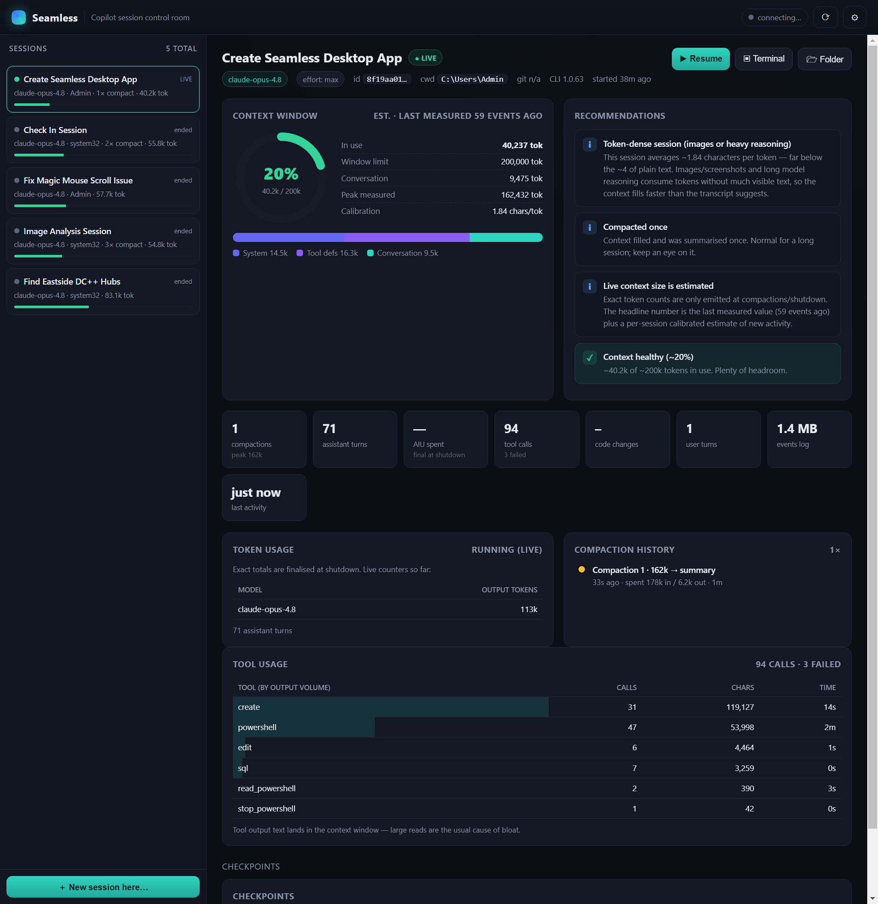

# Seamless

A session-aware **control room for the GitHub Copilot CLI** on Windows.


Seamless auto-discovers your Copilot CLI sessions and renders an *ongoing live webpage* that
reflects each session's internal state — the **context window** (how full it is), the token
breakdown (system / tool definitions / conversation), compaction history, premium-request /
AIU cost, tool usage, and **efficiency recommendations** when a session gets large or
token-dense. It is session-id / cwd / git-branch / worktree aware, and lets you **resume** any
session or open a plain terminal in its working directory with one click.

It ships as a native desktop app (Electron) *and* a dependency-free web dashboard you can open
in any browser (or on your phone over the LAN).




---

## Quick start

```powershell
cd C:\Users\Admin\Seamless

# Desktop app (native window + tray)
npm start

# …or just the web dashboard (no Electron needed), then open http://127.0.0.1:4321
npm run server
```

The desktop app and the server both bind `127.0.0.1:4321` by default. The dashboard
auto-refreshes live over Server-Sent Events as your sessions change on disk.

> Tip: to view the dashboard from your phone, set `host` to `0.0.0.0` (see **Settings**) and
> browse to `http://<your-pc-ip>:4321`.

---

## What it shows

- **Session list** — every Copilot session, **live ones first**, then by recency. Each row
  shows the model, cwd basename, compaction count and a context fill bar.
- **Live session header** — model, reasoning effort, session id, **cwd**, **git branch /
  worktree** (when git is available), CLI version, and age.
- **Context window gauge** — percentage full, exact/estimated token total vs the model's
  window limit, plus a **system / tool-defs / conversation** breakdown bar.
- **Recommendations** — leveled hints (good / info / warn / danger): token-dense sessions,
  approaching auto-compaction, large tool reads bloating context, dirty worktree, etc.
- **Usage & cost** — assistant/user turns, premium requests, **AIU spent**, output tokens per
  model, code changes, events-log size.
- **Compaction history**, **tool usage** (by output volume — the usual cause of bloat),
  checkpoints, and todos.
- **Actions** — **Resume** the session (`copilot -C <cwd> --resume <id>`), open a **Terminal**
  in its cwd, reveal its **Folder**, or start a **New session here**.

---

## How context sizing works

Copilot only emits **exact** token counts at a few moments (`session.compaction_start`,
`session.compaction_complete`, `session.shutdown`). Between those, Seamless shows:

- a **headline** = the last exact snapshot, labelled with its age ("last measured N events
  ago"), plus
- a **live estimate** = stable exact `system + toolDefinitions` tokens + a *per-session
  calibrated* estimate of the conversation, where the chars→tokens ratio is derived from that
  session's own compaction ground-truth (falling back to ~4 chars/token before the first
  compaction).

This is why an image- or reasoning-heavy session can read ~1.8 chars/token and fill its window
faster than the visible transcript suggests — Seamless flags exactly that.

Compaction count and peak measured tokens are **exact** and used as the primary heaviness
signals.

---

## Architecture

```
src/
  core/        pure Node, no Electron dependency
    config.js    paths, model context limits, thresholds, settings (~/.seamless/config.json)
    util.js      yaml/json parsing, token estimation, formatters
    db.js        safe node:sqlite loader (degrades gracefully on older Node/Electron)
    events.js    THE analyzer — events.jsonl -> live context/usage/compaction/tool state
    sessions.js  discovery + per-session detail (merges global DB + session-state dirs)
    git.js       branch / worktree / dirty / ahead-behind (no-ops when git is absent)
    analyze.js   recommendation engine
    actions.js   resume / new / terminal / open-folder launchers
    watch.js     debounced recursive fs.watch over the session-state dir
  server/
    server.js    node:http REST + SSE + static file server
  web/           vanilla dashboard (no build step): index.html, styles.css, app.js
  electron/
    main.js      desktop shell: boots the server in-process, window, tray, menu, IPC
    preload.cjs  contextBridge API
```

The **only** external dependency is Electron, and it's optional — `npm run server` runs the
full dashboard dependency-free.

### Data sources (read-only)

- Global `~/.copilot/session-store.db` — sessions, turns, checkpoints (read via Node's built-in
  `node:sqlite` when available).
- Per-session `~/.copilot/session-state/<id>/` — `workspace.yaml`, `events.jsonl` (the live
  source of truth), `session.db` (todos), `checkpoints/*.md`.

Seamless never writes to Copilot's data; it only reads it and launches `copilot` for you.

---

## Settings

Stored at `~/.seamless/config.json` (editable from the dashboard gear menu):

| key    | default       | meaning                                            |
| ------ | ------------- | -------------------------------------------------- |
| `port` | `4321`        | server port                                        |
| `host` | `127.0.0.1`   | bind address; set `0.0.0.0` to expose on the LAN   |

Model context-window limits and warn/danger thresholds live in `src/core/config.js`.

---

## Requirements

- **Node.js ≥ 22.5** for full features (built-in `node:sqlite`). On Node 20 / Electron 33 the
  global-DB extras degrade gracefully and core discovery still works from `events.jsonl` and
  `workspace.yaml`.
- The `copilot` CLI on `PATH` (for Resume / New).
- Git is optional — branch/worktree info simply doesn't render when git isn't installed.

## Scripts

| command          | does                                            |
| ---------------- | ----------------------------------------------- |
| `npm start`      | launch the Electron desktop app                 |
| `npm run server` | run just the web dashboard server               |
| `node test/test-core.mjs` | smoke-test the core analyzer against live data |

## License

MIT
